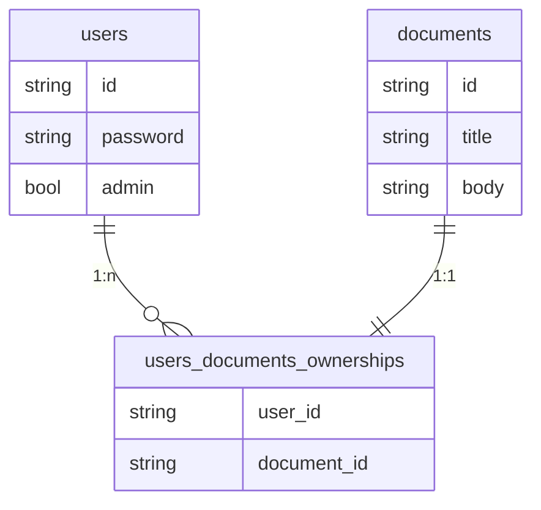

```mermaid
erDiagram

users {
    string id
    string password
    bool admin
}

documents {
    string id
    string title
    string body
}

users_documents_ownerships {
    string user_id
    string document_id
}

users ||--o{users_documents_ownerships: "1:n"
documents ||--||users_documents_ownerships: "1:1"
```

---
[交差テーブルには関連の意味を表す名前をつけよう](
https://qiita.com/tkawa/items/dc3e313021f32fd91ca6)

|関係|英語|
|---|---|
|所有|ownership|
|公開|publishing|